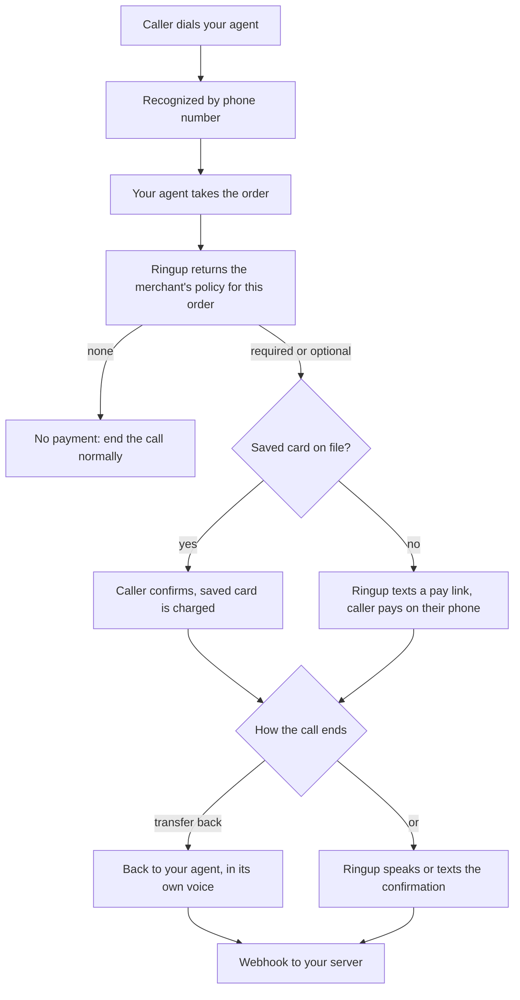

Ringup is the payments layer for AI voice agents. It lets an agent take payment on a phone call
the way a good checkout does on the web. The first time, the caller pays through a texted link
and saves a card. Every time after, the agent recognizes them and charges that card in one
sentence. Charges settle on the merchant's own payment processor.

## A remembered checkout

The heart of Ringup is memory. An ordinary phone payment makes the caller read a card number
aloud on every single call. Ringup does it once. A first-time caller gets a texted link, pays
on a hosted page, and their card is saved. From then on, any business connected to Ringup
recognizes them and charges the saved card on a spoken yes. It is a checkout that remembers the
customer, over the phone.

> "That is nineteen dollars on your Visa ending 5858, shall I put it through?"
>
> "Yep."
>
> "Done. Your confirmation number is 2PJJZY."

Capturing a card during a call is table stakes; every platform that offers it makes the caller
enter the card every time. Recognizing a returning caller and reusing a saved card is the part
nobody else does, and it is the product.

## The core principles

**Phone number is the identity.** The caller is recognized by the number they are calling from,
resolved from trusted call metadata, never typed by the model or spoken by the caller. No
logins, no account numbers, no passwords. See [Caller Identity](/concepts/identity) and [Merchant Identity](/concepts/merchant-identity).

**Recognition happens at the start of the call.** The caller's number arrives the instant the
call connects, so Ringup identifies them upfront, before payment. For a returning caller that
hands the agent their name and saved card at the greeting, so the agent personalizes the whole
call: it greets them by name and skips re-asking for anything recognition already provides. See
[Recognize at the start of the call](/concepts/identity).

**First time by link, every time after by memory.** A caller Ringup does not recognize is texted
a secure pay link and pays on their phone; the card is saved with their consent. A caller Ringup
recognizes is offered their saved card by brand and last four. One path enrolls, the other
remembers.

**Processor-agnostic.** Charges settle on the merchant's own payment processor, at their rates,
in their dashboard. Ringup never becomes the merchant of record and never holds the money. Each
merchant connects their own processor once.

**No card number ever touches you.** Card entry happens once, on a hosted page served by the
processor. The number never appears in audio, transcripts, or your servers, which keeps both
you and the merchant out of PCI scope. On the voice path there is no card field at all.

**The merchant owns the policy.** Whether payment is required, optional, or not needed for an
order is a merchant setting Ringup serves per purchase, not logic in your agent. A merchant
changes the rule with no redeploy and no agent edit, and a merchant who has not connected yet
simply gets their normal, payment-free call. See [Payment policy](/concepts/payment-policy).

**No model in the money path.** The code that moves money is deterministic. The language model
asks Ringup to charge; it never computes or moves money itself, and it never sees a card number.

## How a call flows

At a high level, the same flow runs on every platform:

Everything above is the same on every platform. What differs is only how your agent reaches
Ringup.

## Two ways to integrate

You add Ringup one of two ways, the same split a web merchant chooses between a hosted checkout and
an API-driven one. Both use the same tools, the same identity, and the same off-session charge.

- **Hosted.** Ringup takes the payment on its own line. Your agent hands the call off at the payment
  moment and Ringup runs the whole payment conversation: confirm the amount, charge, handle a
  decline, text a first-time link, read the confirmation. You write no payment logic and set it up
  from the dashboard. The handoff is either a transfer to a Ringup payment line (works on any
  platform, see [Checkout Session](/concepts/checkout-session)) or, where the platform supports it,
  an in-call handoff in your agent's own voice with no transfer.
- **In your agent (API).** Your agent stays on the call the whole time and calls Ringup's tools to
  add payment: [`identify`](/concepts/identity) at the greeting, then [`charge`](/concepts/charge)
  for a recognized caller with a saved card, or [`send_link`](/concepts/send-link) for a first-time
  caller. Nothing transfers, and because a recognized caller never enters a card, no card data ever
  touches your agent. The lighter, more flexible path.

Same payment underneath, same principles. Only the front door changes.

## Next steps

<CardGroup cols={2}>
  <Card title="Pick your platform" icon="wrench" href="/integrations/vapi/call-transfer">
    Vapi, Retell, ElevenLabs, and the rest, in the Integrations section.
  </Card>
  <Card title="Caller Identity" icon="user" href="/concepts/identity">
    Start the Concepts walk: who is calling, recognized at the greeting.
  </Card>
</CardGroup>
